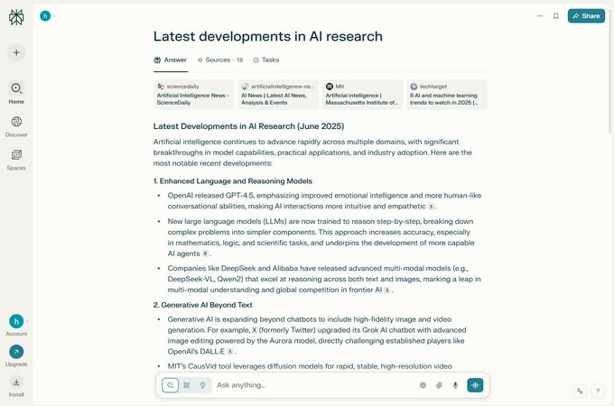
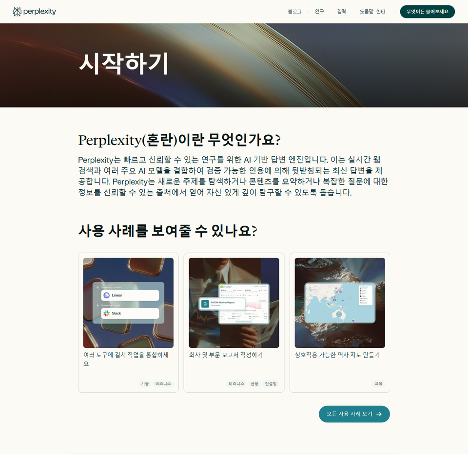
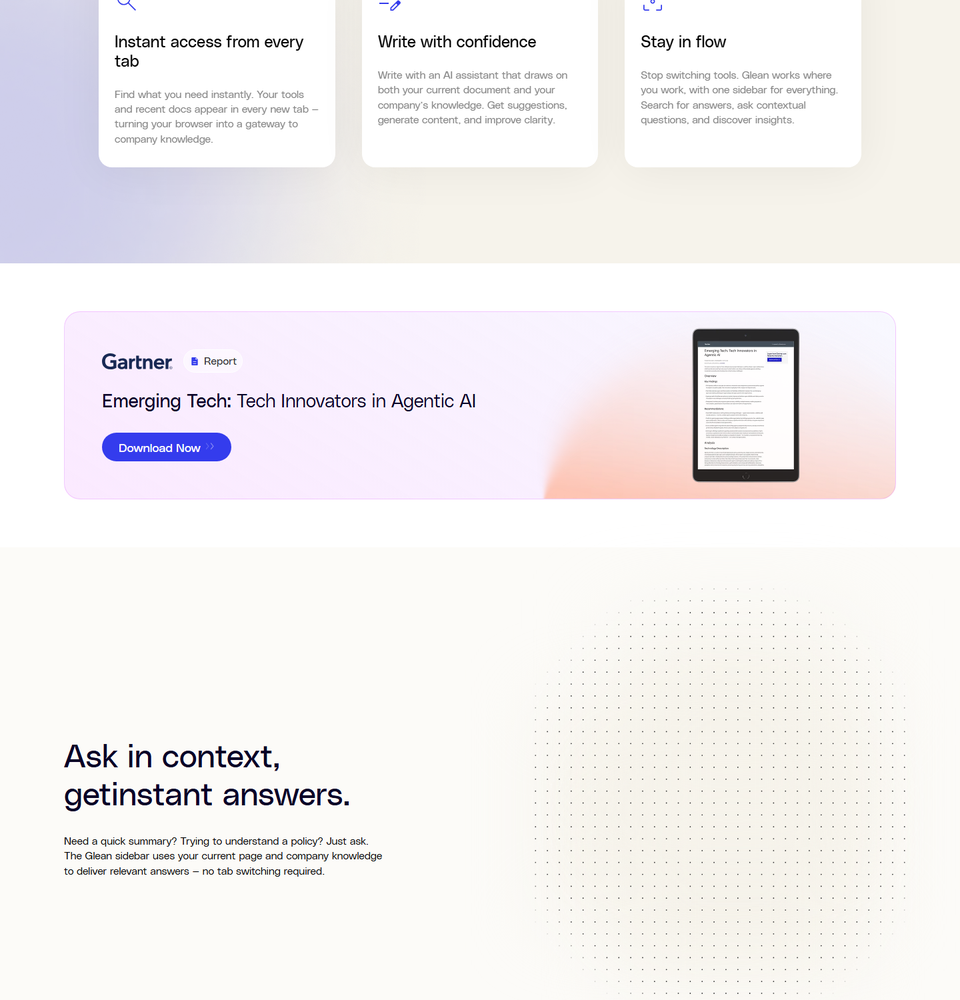
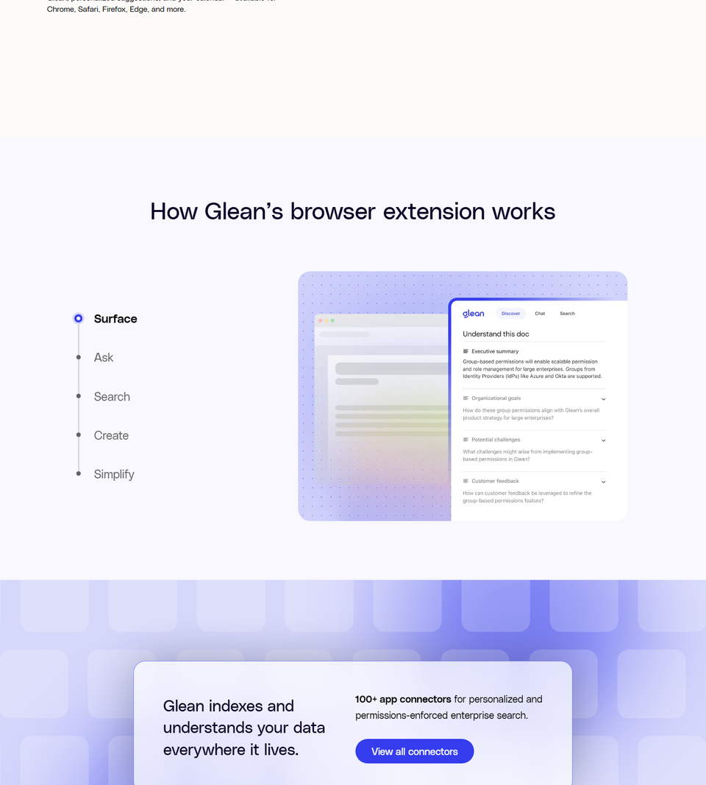
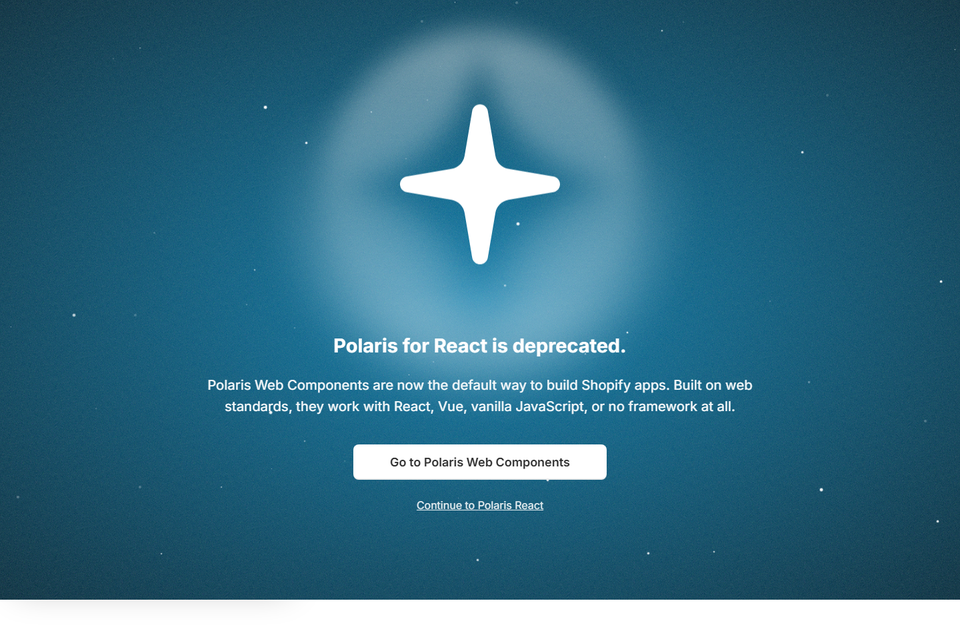
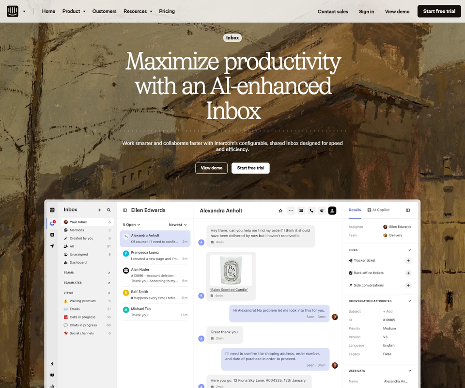
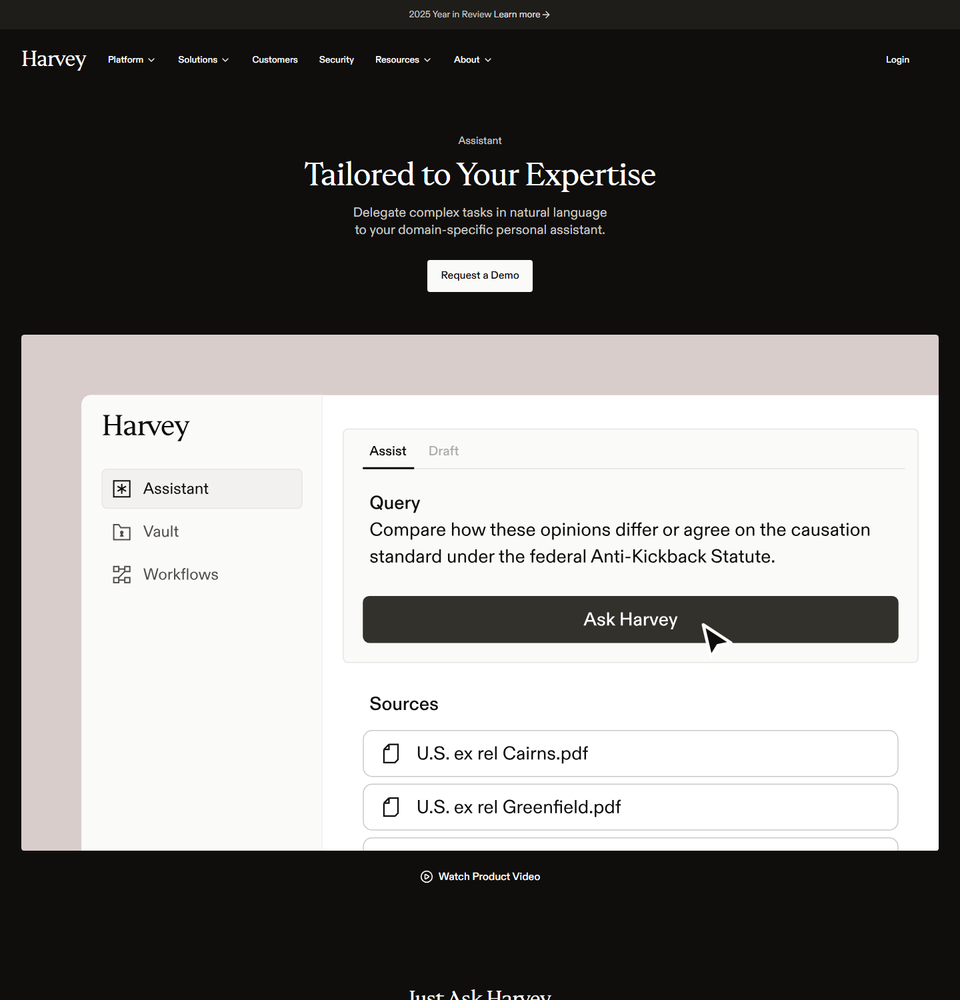
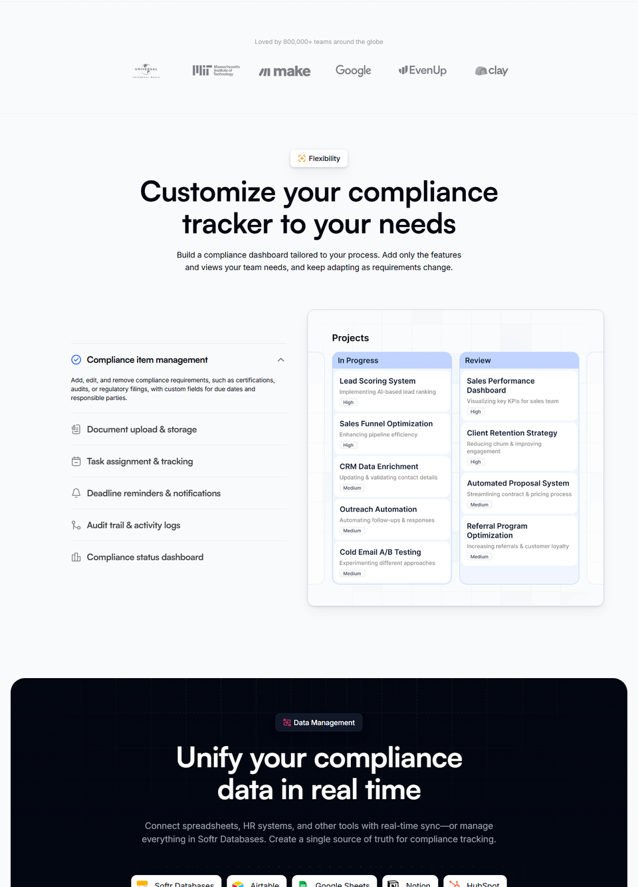
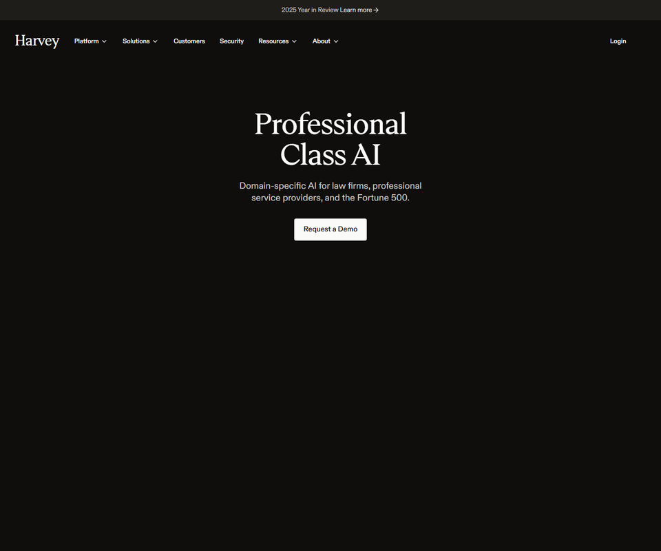
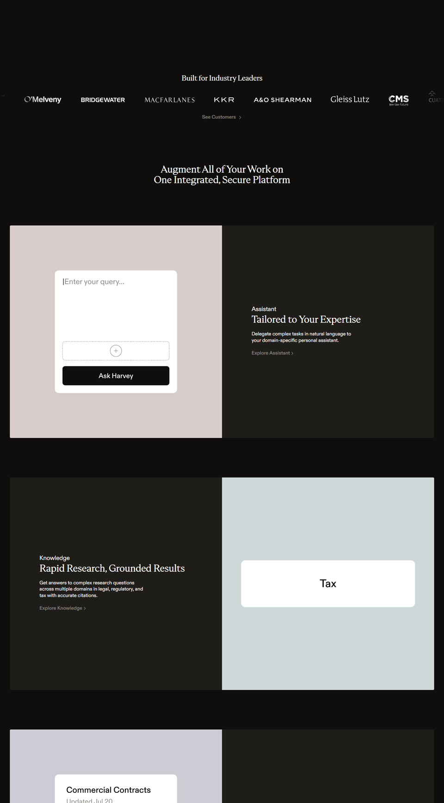

# 메드클레임 2.0 UI/UX 개편 리서치

> 2026.01.23 회의 기반 | 벤치마크 조사 + 화면 캡처 통합본

---

## 회의 핵심 요구사항

| # | 요구사항 | 배경 |
|---|---------|------|
| 1 | 포털/대시보드형 메인 화면 | 검색창만 있는 GPT 스타일 → 업무 현황판으로 |
| 2 | 정보가 흐르는 피드 | 검색 없이도 최신 법령·고시·뉴스가 보여야 함 |
| 3 | 개인화 리포트 | "OOO님을 위한 보고서" 형태로 클릭 유도 |
| 4 | 검색 + 챗봇 통합 | 자료검색·메디챗 분리 → 하나의 입력창 |
| 5 | 답변 신뢰성 확보 | 할루시네이션 불신 해소 (원문 근거 대조) |
| 6 | 스크롤/클릭 최소화 | 한 화면 통합 정보, 직관적 구조 |
| 7 | 전문적 톤앤매너 | 민트색 정비, 의료/법률 전문가 툴 느낌 |

---

## 1. 정보 피드 + 검색 결합

> **문제:** 빈 검색창 → 뭘 물어야 할지 모름, 재방문 동기 없음

### 벤치마크 A: Perplexity AI

AI 검색 엔진. 검색 + 출처 인용 + Discover 피드가 한 화면에 공존.

- **홈 상단**: 중앙 검색창 + Focus 모드 (All, Academic, Writing 등)
- **홈 하단**: Discover 피드 — 카테고리별 트렌딩 토픽, 뉴스 카드
- **개인화**: 관심 키워드·역할·목표 설정 → 맞춤 큐레이션
- **답변**: 인라인 인용 번호 + 소스 링크 + Follow-up 질문 제안
- **Spaces**: 주제별 연구 허브

| Perplexity 요소 | 메드클레임 적용 |
|-----------------|----------------|
| Discover 피드 | 최신 행정예고·개정 고시·삭감 사례 카드 |
| Focus 모드 | [심사지침] [고시·법령] [사례] 검색 범위 칩 |
| Follow-up 질문 | "관련 급여 기준도 확인하시겠어요?" |
| Spaces | 병원별/진료과별 연구 공간 |

**검색 결과 화면** — 좌측 네비(Home/Discover/Spaces), 인라인 소스 번호, Follow-up:



**시작하기 허브** — 검색·연구·실험실 기능 구조:



### 벤치마크 B: Glean

사내 앱 통합 AI 검색. 브라우저 새 탭 = 업무 커맨드 센터.

- **새 탭**: 접속 즉시 추천 문서, 캘린더, 알림
- **Discover**: 현재 화면 기반 관련 리소스 자동 추천
- **사이드바**: Alt+J로 어디서든 열리는 AI 어시스턴트

| Glean 요소 | 메드클레임 적용 |
|-----------|----------------|
| 새 탭 커맨드 센터 | 로그인 즉시 "오늘의 변경사항" 대시보드 |
| 추천 문서 | "OOO 병원 맞춤형 최신 고시" 자동 노출 |
| Discover | 현재 조회 중인 심사 기준 관련 추천 |
| 사이드바 | EMR에서 바로 열리는 질문창 (장기 목표) |

**브라우저 확장 히어로** — "Work smarter, without leaving your browser":


**Ask in context** — 탭 이동 없이 문맥 기반 즉시 답변:



**Discover** — 현재 화면 기반 관련 리소스 자동 추천:


**새 탭 커맨드 센터** — 추천 문서 + 캘린더 + 알림:



### 메드클레임 적용

- 메인 진입 시 검색 전에도 **3~4개 카드**가 바로 보이는 구조
- 카드 예: [개정 급여 기준 Top 3] [다빈도 삭감 사례] [심평원 공지]

---

## 2. 개인화 인사 + 브리핑 위젯

> **문제:** 공공 데이터 = "무료" 인식 → AI 가공·요약의 가치 인식 필요

### 벤치마크: Shopify Admin + Intercom

**Shopify Admin** — 로그인 즉시 매출·주문·할 일 스냅샷 + 맞춤 추천 카드.

**Intercom Messenger Home** — "회사의 프론트 데스크". 대화 목록 대신 **기능 카드** 중심 설계.
- 95% 대화가 24시간 내 종료 → 대화 중심이 아닌 기능 중심
- 모듈형 앱 시스템: 상황에 따라 홈 화면 즉시 재배치

| 참고 요소 | 메드클레임 적용 |
|----------|----------------|
| Home 스냅샷 | "오늘 확인할 규정 변경 N건" 요약 |
| 앱 카드 홈 | 기능별 카드(검색, 최신고시, 리포트) 자유 배치 |
| 모듈형 구조 | 역할별(간호사/의사) 카드 다르게 구성 |
| 인사말 | "OOO님, 오늘 확인할 변경사항이 있습니다" |

**Shopify Polaris 디자인 시스템** — Badge, Banner, Card 등 컴포넌트:



**Intercom AI Inbox** — Copilot + 우측 사이드바:



**Intercom Inbox 기능** — 팀원별 커스터마이즈, 연동 정보:


### 메드클레임 적용

- **상단 인사 카드**: "심사팀장님, 오늘 **행정 예고 2건** 도착. (요약 보기 >)"
- **행동 유도**: "이번 개정안은 귀원 '물리치료 청구'에 영향을 줄 수 있습니다."
- 클릭 → AI 분석 리포트로 연결

---

## 3. 통합 검색 + 챗봇

> **문제:** 자료검색 / 메디챗 분리 → 사용자 혼란

### 벤치마크: B2B SaaS 통합 검색 패턴

- **하나의 입력창** + placeholder: "심사 기준, 급여 여부를 자연어로 물어보세요"
- **빠른 액션 칩**: [심사지침] [고시·법령] [사례 질문] [변경사항 필터]
- 자동완성으로 정확한 용어 유도 → 띄어쓰기 민감도 완화

Perplexity Focus 모드가 대표 사례 (섹션 1 캡처 참조).

### 메드클레임 적용

- 메인 중앙에 **단일 통합 입력창**
- 칩 버튼으로 검색 모드 힌트
- 자동완성/추천 검색어

---

## 4. 답변 신뢰성 — Split View + Citation

> **문제:** 할루시네이션 → 실무자 신뢰 하락. "아는 내용 물어봤는데 틀림"

### 벤치마크 A: Harvey AI

변호사 전용 AI. 기업가치 $8B. 설계 원칙: **가독성 + 인용** — 화려함 < 정확함.

- **Source Assured**: 모든 답변이 인용 자료에 기반
- **Citation**: 인용 번호 클릭 → 원문 해당 부분 이동
- **50개 문서** 동시 분석, 문서 기반 답변
- **할루시네이션 60% 감소**, 인용 정확도 23% 향상 (2025)

| Harvey 요소 | 메드클레임 적용 |
|------------|----------------|
| Split View | 좌: AI 요약 / 우: 심평원 원문(PDF) |
| Citation | [1][2] 클릭 → 원문 하이라이트 |
| Source Assured | "근거: OO 고시, 개정일: YYYY-MM-DD" 표시 |

**Assistant 쿼리 UI** — 좌측 네비(Assistant/Vault/Workflows), 질의 입력 + Source 문서 첨부:



**기능 카드** — 문서 업로드·분석, Follow-up 질문, 워크플로우, 협업:


**Source Assured + Citation** — 인용 하이라이트(빨간 텍스트=수정), Multi-Source Support:


**Draft Mode + Word 연동** — 장문 법률 문서 redline 수정, Word에서 직접 사용:


> Harvey는 엔터프라이즈 전용. YouTube "Harvey AI demo"로 실제 UI 확인 가능.

### 벤치마크 B: Softr Compliance Tracker

규제/컴플라이언스 추적 대시보드. 메타데이터(개정일·적용일) 상시 노출.




### 메드클레임 적용

- 답변 화면: **좌: AI 요약 / 우: 심평원 원문** 분할
- 모든 답변에 근거 고시번호·개정일 표시
- **할루시네이션 불신 해소의 가장 강력한 UI**

---

## 5. 카드 레이아웃 + 스크롤 최소화

> **대표 지시:** "스크롤과 클릭을 최소화하고 한 화면에서 통합 정보"

### 벤치마크: B2B SaaS 대시보드 공통 패턴

- 첫 화면 3~4개 정보 블록, 명확한 계층 구조
- 2~3열 카드 레이아웃
- 상세 내용은 모달/오버레이

**헬스케어 UI 사례**:


**Dribbble 헬스케어 SaaS 디자인**:


**Behance SaaS 대시보드**:


### 메드클레임 적용

- **좌측 큰 카드**: 이번 주 규정 변경·행정예고 Top N
- **우측 상단**: 최근 내 질문 요약
- **우측 하단**: 자주 쓰는 기능 바로가기
- 상세 규정은 모달로 띄워 화면 이탈 방지

---

## 6. 톤앤매너 + 컬러 시스템

> **문제:** 현재 민트색이 전문성과 맞지 않음

### 벤치마크: Harvey AI 톤앤매너

**Professional Class AI** — 다크 네이비 기반, 최소 강조색:



**제품 라인업** — Assistant, Knowledge, Vault, Workflows:



### 메드클레임 적용

- **기본 톤**: 네이비 / 차분한 그레이 (전문성, 신뢰감)
- **강조색**: 오렌지·레드는 "삭감 위험", "긴급 변경"에만
- **상태 표현**: 고·중·저 영향도를 배지 색상으로 구분

---

## 7. 역할별 화면 분리

> **문제:** 심사간호사 vs 의사 vs 경영진 니즈가 다름

### 심사간호사 홈

| 위치 | 내용 |
|------|------|
| 상단 | 이번 달 삭감 위험 높은 항목 Top 5 |
| 중단 | 최근 개정 심사 기준 + 자주 검색한 규정 |
| 하단 | 북마크한 지침/고시 바로가기 |

### 의사 홈 (진료 중 빠른 조회)

| 위치 | 내용 |
|------|------|
| 상단 | 진료과별 급여 기준 요약 스니펫 |
| 중단 | 상병/처치 코드 관련 제한·주의사항 |
| 하단 | 최근 질문 케이스 다시 보기 |

### 반응형

- 데스크톱: 2~3열 | 태블릿: 2열 | 모바일: 단일 컬럼, 검색창 고정

---

## 종합 — 메인 화면 구조 제안

```
┌─────────────────────────────────────────────────┐
│  [인사 위젯] 심사팀장님, 행정 예고 2건 도착      │
│  "귀원 물리치료 청구에 영향 → 확인하기 >"        │
├─────────────────────────────────────────────────┤
│                                                 │
│  검색: 심사 기준, 삭감 사례를 물어보세요          │
│  [심사지침] [고시·법령] [사례 질문] [변경사항]    │
│                                                 │
├───────────────────────┬─────────────────────────┤
│                       │  최근 내 질문            │
│  이번 주 규정 변경     │  · 무릎수술 급여기준... │
│  Top 3                │  · 물리치료 삭감사례... │
│  ─────────────────    │─────────────────────────│
│  · 개정 급여기준 A    │  자주 쓰는 기능          │
│  · 행정예고 B         │  [심사지침] [삭감조회]  │
│  · 신규 고시 C        │  [즐겨찾기] [리포트]    │
│                       │                         │
└───────────────────────┴─────────────────────────┘
```

---

## 참고 링크

### 벤치마크 서비스

| 서비스 | 참고 포인트 | URL |
|--------|-----------|-----|
| Perplexity AI | 검색 + Discover 피드 | https://www.perplexity.ai/ |
| Glean | 엔터프라이즈 AI 검색 포털 | https://www.glean.com/ |
| Harvey AI | Citation, Split View, 톤앤매너 | https://www.harvey.ai/ |
| Shopify | Polaris 디자인 시스템 | https://polaris.shopify.com/ |
| Intercom | 모듈형 앱 카드 홈 | https://www.intercom.com/ |
| Softr | 컴플라이언스 트래커 | https://softr.io/ |

### 디자인 갤러리

| 사이트 | URL |
|--------|-----|
| SaaSFrame (대시보드 159개) | https://www.saasframe.io/categories/dashboard |
| Dribbble (Health SaaS) | https://dribbble.com/tags/health-saas |
| Behance (SaaS Dashboard) | https://www.behance.net/search/projects/saas%20dashboard |
| KoruUX (Healthcare UI 50개) | https://www.koruux.com/50-examples-of-healthcare-UI/ |

### 아티클

- [B2B SaaS 대시보드 설계 6단계](https://uxdesign.cc/design-thoughtful-dashboards-for-b2b-saas-ff484385960d)
- [Harvey AI 신뢰 구축 사례](https://medium.com/@takafumi.endo/how-harvey-built-trust-in-legal-ai-a-case-study-for-builders-786cc23c3b6d)
- [헬스케어 대시보드 포털](https://blog.patoliyainfotech.com/healthcare-dashboard-portal-improves-visibility/)
- [Perplexity 사용 가이드 (스크린샷)](https://www.byriwa.com/how-to-use-perplexity-ai/)
