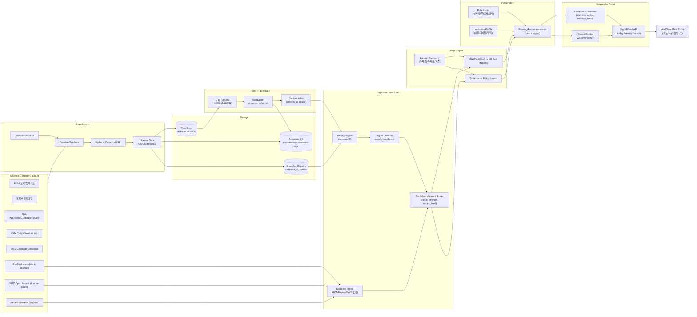
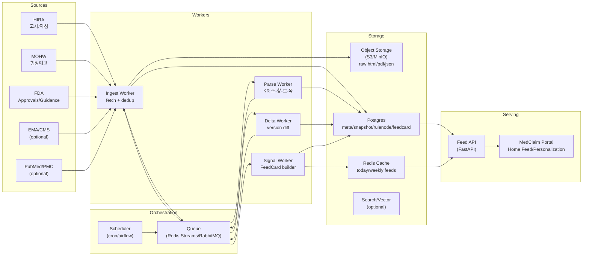

## RegScan Architecture



---

## 핵심 포인트 (RegScan 범위 고정)

### 1) RegScan은 **“콘텐츠 생산 엔진”**

- 결과물은 **FeedCard / Report**
- Q&A 정답/거짓 통제는 **MedClaim 본체 책임**

### 2) 신뢰도/영향도 점수는 **피드 노이즈 제어용**

- `impact_level`, `signal_strength`로 카드 우선순위 정렬
- “답변 게이트”로 쓰지 않음(그건 MedClaim)

### 3) 스냅샷/버전은 **재현성 + 변경점 계산용**

- 피드에서 “오늘 바뀐 이유”를 만들려면 versioning 필수

---

## FeedCard (출력 스키마 예시, 최소 필드)

- `card_id`
- `source_snapshot_id`
- `change_type` (new/revise/delete)
- `domain` (약제/행위/기준/기기/검사…)
- `impact_level` (high/mid/low)
- `title`
- `why_it_matters` (1~2문장)
- `effective_date` (있으면 필수)
- `citations_meta[]` (doc_id, version, section_ref)

---

# 1) KR 조–항–호–목 파서 스펙

## 1.1 목표

- 한국 법령/고시/지침 텍스트에서 **계층 구조(조-항-호-목)를 정확히 복원**
- 각 노드를 **RuleNode**로 저장하고, 상위 노드(부모) 텍스트 컨텍스트를 유지
- **변경점(Delta)** 계산 단위를 “문서”가 아니라 **노드 단위**로 만들기

---

## 1.2 용어/단위 정의

### 계층 단위

- **조(Article)**: `제10조`, `제10조의2`
- **항(Paragraph)**: `①`, `②` … (원문은 동그라미 숫자)
- **호(Item)**: `1.`, `2.` … 또는 `1)`, `2)` (문서별 다양)
- **목(Subitem)**: `가.`, `나.` … 또는 `가)`, `나)`

### 최소 해석 단위(Atomic Rule)

- 기본: `조 + 항 + (호?) + (목?)`
- 단, 항이 “다음 각 호”처럼 상위 트리 선언만 있고 실질 조건은 호/목에 있으면
    
    **호/목이 Atomic Rule**이 된다.
    

---

## 1.3 입력 전처리 규칙

### 텍스트 정규화

- 공백: 연속 공백 축소
- 줄바꿈: 원문 줄바꿈 유지하되, 파싱은 “행 단위”로 진행
- 특수문자:
    - 동그라미 숫자(①②…)는 내부적으로 `P1,P2` 같은 토큰으로 매핑해도 됨
- 표/별표:
    - 표는 별도 파서로 보내고(가능하면), 본 파서는 “표 캡션/별표 제목”을 **SectionNode**로만 유지

---

## 1.4 토큰 인식(Regex/패턴) — 권장

> 실제 구현은 문서별 예외가 있으니 “룰 기반 + fallback”로 가는 게 안정적
> 
- 조: `^제\s*\d+\s*조(의\s*\d+)?`
- 항: `^[①②③④⑤⑥⑦⑧⑨⑩⑪⑫⑬⑭⑮]`
- 호: `^(\d+)[\.\)]\s+`
- 목: `^[가-힣][\.\)]\s+` (대개 ‘가. 나.’)

---

## 1.5 파싱 알고리즘 (스택 기반)

### 상태 스택

- `current_article`
- `current_paragraph`
- `current_item`
- `current_subitem`

### 로직

1. 새 `조` 감지 → article 갱신, 하위 상태 전부 reset
2. 새 `항` 감지 → paragraph 갱신, item/subitem reset
3. 새 `호` 감지 → item 갱신, subitem reset
4. 새 `목` 감지 → subitem 갱신
5. 일반 문장:
    - 직전 활성 노드에 append (보통 subitem > item > paragraph > article 우선)

---

## 1.6 출력 데이터 모델 (RuleNode)

### 필수 필드

- `node_id`: 해시( doc_id + version_id + path + text_hash )
- `doc_id`, `version_id`, `snapshot_id`
- `path`: `{article, paragraph, item, subitem}` (없으면 null)
- `level`: `article|paragraph|item|subitem|section`
- `text`: 해당 노드 본문
- `parents`: 상위 노드 참조 리스트 (node_id)
- `effective_date`, `revised_date` (있으면)
- `source_locator`: 원문 위치(HTML xpath, PDF bbox 등)

### 파생 필드(추천)

- `atomic_rule_text`: 상위 컨텍스트를 포함해 “단독 이해 가능”하게 합성한 텍스트
    
    (ex. “제10조(급여범위) ① … 1. … 가. …”)
    

---

## 1.7 Delta(변경점) 계산 단위

- 키: `doc_id + path(article,paragraph,item,subitem)`
- 변경 유형:
    - `added`, `deleted`, `modified`
- `modified`는 text diff로 하되, 실무용 Signal 생성 시
    - **추가/삭제**를 더 높은 impact로 취급

---

# 2) RegScan “물리 아키텍처” (DB/큐/배치/서빙)

## 2.1 설계 목표

- **배치 수집/파싱/델타/시그널 생성**을 안정적으로
- 메인 포털(MedClaim)에서는 **Feed API 호출만**으로 카드/리포트 소비
- 재현성: `snapshot_id/version_id`로 결과 고정

---

## 2.2 컴포넌트 구성 (권장)

### Ingest/Batch

- **Scheduler**: cron/airflow/temporal 중 택1
- **Workers**: 크롤링/파싱/델타/시그널 단계별 작업자
- **Queue**: Redis Streams / RabbitMQ / SQS (사내 환경 맞춰)

### Storage

- **Object Storage**: S3/MinIO (raw HTML/PDF/JSON 원본)
- **Relational DB**: Postgres (메타데이터, 스냅샷, FeedCard)
- **Search/Vector (옵션)**: OpenSearch/Qdrant (검색/유사도 필요 시)

### Serving

- **Feed API**: FastAPI
- **Cache**: Redis (오늘/주간 피드 캐시)

---

## 2.3 데이터 흐름 (배치 파이프라인)

1. Scheduler가 `ingest_job` 발행
2. Ingest worker가 원문 fetch → raw store 저장 → snapshot 등록
3. Parse worker가 raw → RuleNode 생성 → DB 저장
4. Delta worker가 이전 snapshot과 비교 → changeset 생성
5. Signal worker가 changeset + 정책 룰 → FeedCard 생성
6. Feed API가 DB/캐시에서 카드 제공

---

## 2.4 물리 아키텍처 다이어그램



---

# 3) FeedCard JSON 스키마 (권장)

## 3.1 설계 원칙

- *카드는 “변경점 요약 + 왜 중요한지 + 근거 메타”**까지만
- 본문 원문/하이라이트 UI는 MedClaim이 하되, RegScan은 **locator만 제공**
- 개인화는 “정답”이 아니라 **랭킹/타겟팅 필드**로만 제공

---

## 3.2 JSON Schema (권장 필드)

```json
{
  "card_id": "string",
  "created_at": "YYYY-MM-DDThh:mm:ssZ",
  "source": {
    "authority": "HIRA|MOHW|FDA|EMA|CMS|PUBMED",
    "doc_id": "string",
    "doc_type": "notice|guideline|law|announcement|approval|paper",
    "snapshot_id": "string",
    "version_id": "string",
    "url": "string"
  },
  "change": {
    "change_type": "new|revise|delete",
    "change_scope": "document|article|paragraph|item|subitem|table",
    "path": {
      "article": "제10조",
      "paragraph": "①",
      "item": "1",
      "subitem": "가"
    },
    "revised_date": "YYYY-MM-DD",
    "effective_date": "YYYY-MM-DD"
  },
  "classification": {
    "domain": "drug|procedure|material|policy|payment|other",
    "impact_level": "high|mid|low",
    "signal_strength": 0.0,
    "audience": ["review", "billing", "doctor", "executive"]
  },
  "content": {
    "title": "string",
    "summary": "string",
    "why_it_matters": "string",
    "recommended_actions": ["string", "string"]
  },
  "citations_meta": [
    {
      "locator_type": "html_xpath|pdf_bbox|section_id",
      "locator_value": "string",
      "quote_span": {
        "start": 0,
        "end": 0
      }
    }
  ],
  "personalization": {
    "rank_score": 0.0,
    "tags": ["string", "string"]
  }
}

```

---

## 3.3 FeedCard 예시 (실제 payload 느낌)

```json
{
  "card_id": "KR-MOHW-20260130-0007",
  "created_at": "2026-02-02T03:10:00Z",
  "source": {
    "authority": "MOHW",
    "doc_id": "MOHW-LEG-2026-013",
    "doc_type": "announcement",
    "snapshot_id": "snap_20260202_0012",
    "version_id": "v1",
    "url": "https://example.go.kr/..."
  },
  "change": {
    "change_type": "new",
    "change_scope": "document",
    "path": { "article": null, "paragraph": null, "item": null, "subitem": null },
    "revised_date": "2026-01-30",
    "effective_date": "2026-02-27"
  },
  "classification": {
    "domain": "policy",
    "impact_level": "mid",
    "signal_strength": 0.72,
    "audience": ["executive", "review"]
  },
  "content": {
    "title": "「국민건강보험법」 일부개정 입법예고",
    "summary": "보험 운영 및 제도 관련 조항 개정이 예고되었습니다.",
    "why_it_matters": "의견제출 기간 내 주요 쟁점이 반영될 수 있어 내부 검토가 필요합니다.",
    "recommended_actions": [
      "핵심 변경 조항(조-항-호) 파싱 후 영향 항목 태깅",
      "의견제출 마감일 이전 내부 코멘트 수렴"
    ]
  },
  "citations_meta": [
    {
      "locator_type": "section_id",
      "locator_value": "sec_0003",
      "quote_span": { "start": 120, "end": 260 }
    }
  ],
  "personalization": {
    "rank_score": 0.64,
    "tags": ["입법예고", "보험제도"]
  }
}

```

---