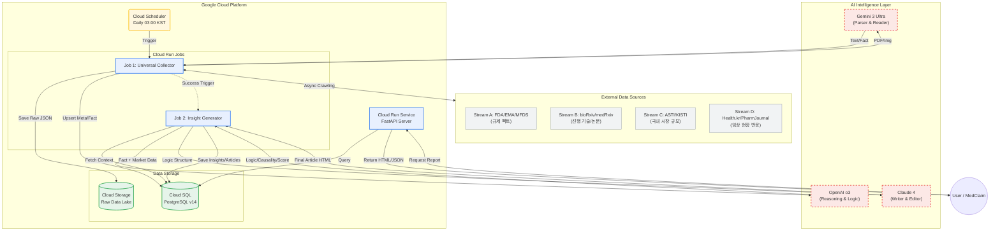

# RegScan v2.0 Integrated Architecture

### 🏛️ RegScan v2.0 통합 아키텍처

기존의 안정적인 수집 파이프라인 위에 **'지능형 분석 계층(Intelligence Layer)'**을 얹는 구조입니다.

### 1. 파이프라인 흐름 재정의 (New Flow)

기존의 `[1] Ingest` 단계에 **새로운 소스**가 추가되고, `[4] Scan` 단계가 **AI 추론 엔진**으로 대체됩니다.

- **[1] Ingest (수집) - 확장**
    - *기존:* FDA, EMA, MFDS, CRIS, HIRA
    - *추가:* **bioRxiv/medRxiv** (선행 연구 PDF), **ASTI** (국내 시장 리포트), **PubMed** (검증용)
- **[2] Parse (파싱) - 고도화**
    - *기존:* HTML 파서
    - *추가:* **Gemini 3 Ultra** (PDF/이미지 등 비정형 데이터 처리 및 팩트 추출)
- **[3] Map (매핑) - 유지**
    - INN 기준 통합 매핑 (기존 로직 유지)
- **[4] Reasoning (추론) - 신설 (핵심)**
    - *역할:* 단순 영향 분석을 넘어선 **'인과관계 및 확률 추론'**
    - *엔진:* **OpenAI o3**
    - *작업:* "FDA 승인(A) + bioRxiv 신기술(B) + ASTI 시장(C) = 한국 시장 파급력(D)" 도출
- **[5] Writing (집필) - 신설**
    - *역할:* 분석 결과를 **'기사/리포트'** 형태로 가공
    - *엔진:* **Claude 4**
- **[6] Store (저장) - 확장**
    - `DrugInsight` 테이블 추가 (AI 분석 결과 저장)
- **[7] Serve (서빙)**
    - HTML 리포트(SSR), Widget API, 뉴스레터

---

### 🗄️ DB 스키마 업그레이드 제안 (Schema v2)

기존 7개 테이블에 **AI 분석 결과를 담을 그릇**이 필요합니다.

| **테이블명** | **기존/신규** | **용도** |
| --- | --- | --- |
| **preprints** | **신규** | bioRxiv/medRxiv 수집 데이터 (논문 ID, 요약, 링크) |
| **market_reports** | **신규** | ASTI 등 시장 리포트 데이터 (기관, 발행일, 시장규모 수치) |
| **ai_insights** | **신규** | o3가 분석한 추론 결과 (파급력 점수, 리스크 요인, 근거) |
| **articles** | **신규** | Claude가 작성한 최종 기사 (HTML 본문, 제목, 태그) |
| *drugs* | *기존* | 약물 마스터 |
| *regulatory_events* | *기존* | 규제 이벤트 |

---

### 🏗️ 인프라 구성도 (GCP Serverless)

아까 합의한 대로 **비용 효율**을 극대화한 구조입니다.

1. **Cloud Scheduler:** 매일 새벽 3시 트리거.
2. **Cloud Run Jobs (Collector):**
    - 컨테이너 1: `legacy-scraper` (FDA/EMA 등 기존 수집)
    - 컨테이너 2: `paper-scraper` (bioRxiv/ASTI 수집 + Gemini 파싱)
3. **Cloud Run Jobs (Analyzer):**
    - 수집 완료 후 실행.
    - DB에서 데이터 꺼내서 **o3 & Claude API** 호출 -> 결과 DB 저장.
4. **Cloud SQL (PostgreSQL):** 모든 데이터의 중앙 저장소.
5. **Cloud Run Service (API):**
    - 사용자 요청 시 DB 조회 -> HTML/JSON 응답.

---

### 📝 형님을 위한 Action Plan

문서(`docs/`) 정리가 잘 되어 있다고 하니, 이 **v2.0 변경 사항**을 문서에 먼저 반영하고 개발 들어가는 게 순서입니다.

1. **`docs/architecture/project_structure.md` 업데이트:**
    - `scrapers/biorxiv.py`, `scrapers/asti.py` 등 파일 경로 추가.
    - `services/reasoning.py` (o3), `services/writing.py` (Claude) 모듈 추가.
2. **`docs/schema/` 업데이트:**
    - 위에서 제안한 신규 테이블(`preprints`, `ai_insights` 등) 스키마 정의 추가.
3. **`roadmap.md` 수정:**
    - "Timeline ML 모델" 대신 **"LLM 기반 Reasoning & Writing 파이프라인"**으로 목표 수정.

---

### 🧩 [Stream D] 임상 현장 반응 (Clinical Sentiment) 추가

기존 파이프라인에 **네 번째 스트림**을 뚫어야 합니다.

| **스트림** | **소스** | **역할** | **키워드** |
| --- | --- | --- | --- |
| Stream A | FDA/MFDS | 규제 팩트 (현재) | **Approval** |
| Stream B | bioRxiv | 미래 기술 (미래) | **Innovation** |
| Stream C | ASTI | 시장 규모 (돈) | **Market Size** |
| **Stream D** | **Health.kr** | **현장 전문가 반응** | **Sentiment** |

### **1. 데이터 가치 분석**

- **KPIC 학술/대한약사저널:** 단순 뉴스가 아닙니다. **"약사들이 공부하는 자료"**입니다.
- **활용 포인트:**
    - **관심도 측정:** FDA 승인 약물 관련 성분(예: GLP-1)에 대한 학술 글이 최근 급증했다? -> **"국내 도입 시 처방 폭발 가능성 높음"**
    - **리스크 탐지:** "비스테로이드성 소염제와 심방세동 위험" 같은 글이 많다? -> **"도입 시 안전성 이슈 대비 필요"**

---

### 🏗️ 기술적 구현 가이드 (Scraper & Logic)

`Health.kr`은 URL 패턴이 `drug_cd` 기반이라, **[검색 -> ID 추출 -> 상세 크롤링]** 2단계 전략이 필요합니다.

### **Step 1. 수집기 (HealthKRScraper)**

Python

```python
class HealthKRScraper:
    BASE_URL = "https://www.health.kr"
    
    def get_expert_reviews(self, drug_inn_kor):
        # 1. 약물명으로 검색해서 drug_cd 따오기
        search_url = f"{self.BASE_URL}/searchDrug/search_result.asp?name={drug_inn_kor}"
        drug_cd = self._parse_drug_code(search_url) 
        
        # 2. 상세 페이지 크롤링 (KPIC 학술, 대한약사저널 섹션)
        detail_url = f"{self.BASE_URL}/searchDrug/result_drug.asp?drug_cd={drug_cd}"
        soup = self._get_soup(detail_url)
        
        # 3. 데이터 추출 (제목, 링크, 요약)
        reviews = []
        # 'KPIC 학술', '대한약사저널' 테이블 파싱 로직
        for row in soup.select("#tab_expert_review tr"): 
            reviews.append({
                "title": row.select_one(".title").text,
                "date": row.select_one(".date").text,
                "source": "KPIC" # or 대한약사저널
            })
        return reviews
```

### **Step 2. o3 프롬프트 강화 (Sentiment Analysis)**

o3에게 이 데이터를 줘서 **"현장의 온도"**를 분석시킵니다.

> **[o3에게 던질 프롬프트]**
> 
> 
> "FDA에서 승인된 이 신약 성분(Dexibuprofen 계열)에 대해, 국내 약학정보원(Health.kr) 데이터를 보니 최근 3년간 '심혈관계 부작용' 관련 학술 리뷰가 5건 있었다.
> 
> 1. **현장 우려:** 국내 약사들은 안전성 이슈를 경계하고 있는가?
> 2. **마케팅 포인트:** 이 신약이 기존 약물의 부작용을 개선했다면, 한국 시장에서 강력한 세일즈 포인트가 될 수 있는가?
> 3. **결론:** '임상적 거부감' 수준을 0~100점으로 평가해."

---

### 📝 수정된 통합 아키텍처 문서 반영 (To-Be)

**`docs/architecture/project_structure.md`** 등에 아래 내용을 추가하십시오.

1. **Ingest Layer:**
    - `scrapers/health_kr.py` 추가 (약학정보원 전용)
2. **DB Schema (`expert_opinions` 테이블 추가):**
    - `id`, `drug_inn`, `title`, `summary`, `pub_date`, `source` (KPIC/PharmJournal), `sentiment_score`
3. **Report Logic:**
    - 기사 생성 시 **"전문가 시각(Expert's View)"** 섹션 신설.
    - *내용 예시:* "FDA 승인 소식과 더불어, 국내 약학계에서도 해당 기전의 '관절 통증 감소 효과'에 주목하는 학술지가 다수 발행되어(대한약사저널, 2023), 현장 수용성은 높을 것으로 전망된다."

### 🚀 한 줄 요약

> **"ASTI가 '돈(시장)'을 보여준다면, 약학정보원은 '사람(약사)'의 생각을 보여줍니다. 이 데이터를 넣으면 RegScan은 '숫자'와 '현장'을 모두 아우르는 대체 불가능한 플랫폼이 됩니다."**
> 

## RegScan v2.0 Integrated Architecture

 **4대 데이터 스트림(FDA, bioRxiv, ASTI, Health.kr)**이 **3대 AI 엔진(Gemini, o3, Claude)**을 거쳐 **고부가가치 리포트**로 변환되는 과정



---

### 🏛️ 아키텍처 핵심 설명

이 다이어그램은 **데이터가 어떻게 '정보'를 넘어 '지능'이 되는지**를 보여줍니다.

1. **Ingestion (좌측 Sources):**
    - *4개의 파이프라인(Stream A~D)**이 동시에 돌아가며 규제, 기술, 시장, 현장 반응을 긁어모읍니다.
2. **Intelligence (상단 AI Layer):**
    - **Gemini:** 복잡한 PDF 논문과 차트를 읽어 '데이터화' 합니다.
    - **o3:** 흩어진 정보들 사이의 **인과관계(규제-기술-시장)**를 추론하고 검증합니다.
    - **Claude:** 분석된 내용을 바탕으로 **전문가 수준의 리포트**를 작성합니다.
3. **Processing (중앙 Cloud Run Jobs):**
    - 서버를 24시간 켜두지 않고, **배치(Job)** 형태로 필요한 순간에만 실행되어 비용을 최소화했습니다.
    - `Collector`(수집)와 `Analyzer`(분석)를 분리하여 안정성을 확보했습니다.
4. **Storage & Serving (하단):**
    - 모든 결과물은 **Cloud SQL**에 구조화되어 저장되며, **FastAPI**를 통해 메드클레임 등 외부 서비스로 즉시 배포됩니다.